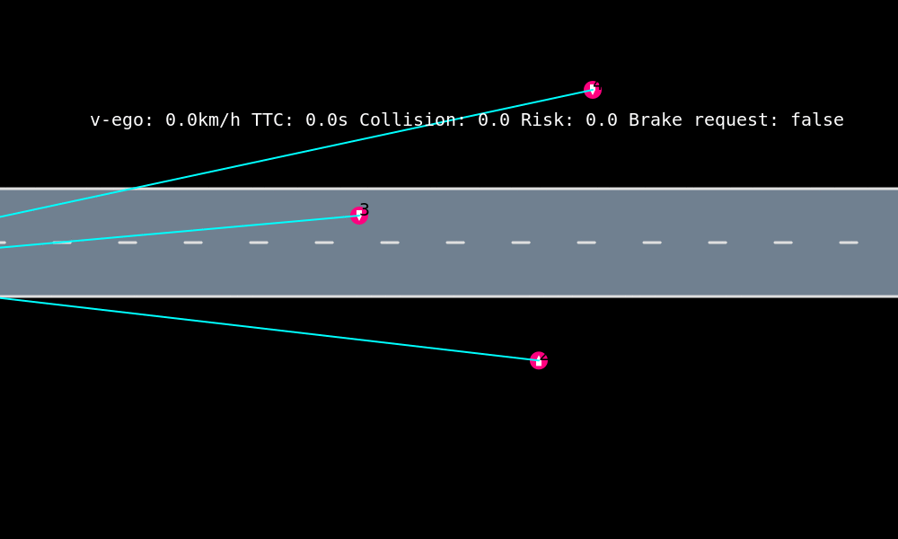
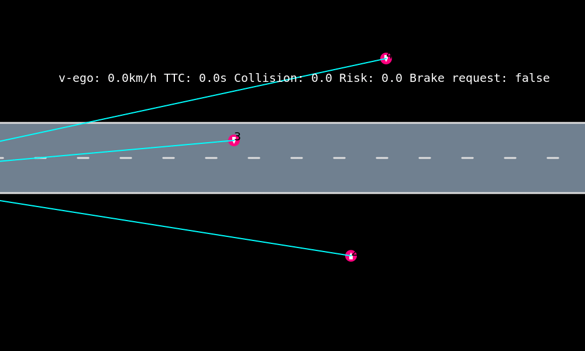

# EmergencyBrakingSystem

[](https://travis-ci.org/sisl/EmergencyBrakingSystem.jl)
[](https://coveralls.io/github/sisl/EmergencyBrakingSystem.jl?branch=master)

# EmergencyBrakingSystem: Emergency Braking System for Pedestrians

contact: Markus Schratter, [m.schratter@gmx.at](m.schratter@gmx.at) Maxime Bouton, [boutonm@stanford.edu](boutonm@stanford.edu)


## CPAN25 50km/h



## False Positive Test

A pedestrian corsses the road, but there is no brake intervention required.

## Installation

To install this package and its dependency, it is recommended to use julia > 1.1 and add the SISL registry and the JuliaPOMDP registry. 
You can run the following line in the julia REPL: 
```julia 
using Pkg 
Pkg.add("POMDPs")
using POMDPs
POMDPs.add_registry() # add JuliaPOMDP registry 
Pkg.Registry.add("https://github.com/sisl/Registry") # add sisl registry 
Pkg.add("EmergencyBrakingSystem") # install the package and its dependencies
```

## Code to run

Run `test.ipynb` for a visualization of the different scenarios.

## Folder structure

- `src/` 
- `docs/`
- `test/`
